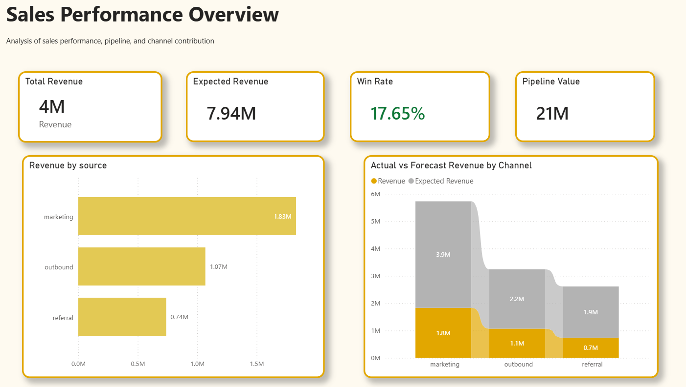
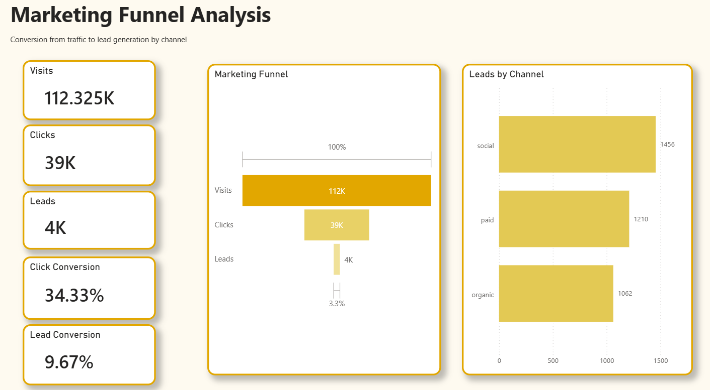
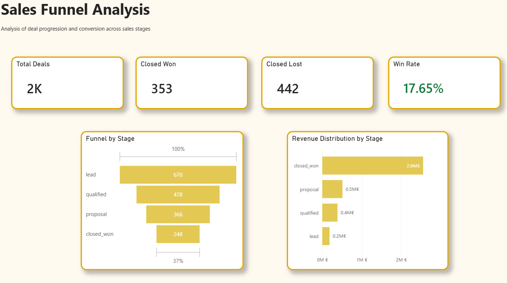

# End-to-End Sales & Marketing Analytics Dashboard

End-to-end Sales & Marketing Analytics dashboard (Power BI + Python) | B2B SaaS simulation with funnel analysis, conversion rates, and revenue insights

---

## 📌 Project Overview (EN)

This project presents an end-to-end sales and marketing analytics solution using synthetic data to simulate a B2B SaaS environment.  
The dashboard connects marketing funnel performance with the sales pipeline to analyze conversion rates, revenue generation, and channel effectiveness.

---

## 📊 Dataset

### Marketing Data
- Visits
- Clicks
- Leads
- Source (social, paid, organic)

### Sales Data
- Deal stages
- Probabilities
- Revenue (deal value)
- Sales representatives

---

## 📈 Dashboard Structure

### 1. Sales Performance Overview
- Revenue (actual vs expected)
- Win rate
- Pipeline value
- Revenue by channel

### 2. Marketing Funnel Analysis
- Visits → Clicks → Leads
- Conversion rates
- Leads by channel

### 3. Sales Funnel Analysis
- Lead → Qualified → Proposal → Closed Won
- Conversion across stages
- Revenue distribution by stage

---

## 💡 Key Insights

- Marketing drives the highest volume of leads  
- Outbound and referral channels generate higher-value deals  
- Significant drop-off between lead and qualified stages  

---

## 🛠️ Tools & Technologies

- Power BI  
- Python (data generation)  
- Pandas / NumPy  

---

## 🚀 How to Use

1. Download the dataset or generate it using Python scripts  
2. Open the Power BI file (.pbix)  
3. Explore the dashboards  

---

## 🇩🇪 Deutsche Version

### 📌 Projektübersicht

Dieses Projekt zeigt eine End-to-End Analyse von Vertriebs- und Marketingdaten auf Basis synthetischer Daten, die eine B2B-SaaS-Umgebung simulieren.  
Das Dashboard verbindet Marketing-Funnel-Daten mit der Sales-Pipeline zur Analyse von Conversion Rates, Umsatz und Kanalperformance.

---

### 📊 Daten

**Marketingdaten**
- Besuche
- Klicks
- Leads
- Quelle (social, paid, organic)

**Vertriebsdaten**
- Deal-Stages
- Wahrscheinlichkeiten
- Umsatz
- Sales-Reps

---

### 💡 Zentrale Erkenntnisse

- Marketing generiert das größte Lead-Volumen  
- Outbound und Referral liefern höhere Deal-Werte  
- Deutlicher Drop zwischen Lead und Qualified  

---

## 👩‍💼 Author

Sonicar Mayora  
Data Analyst | Business Intelligence  
Germany
